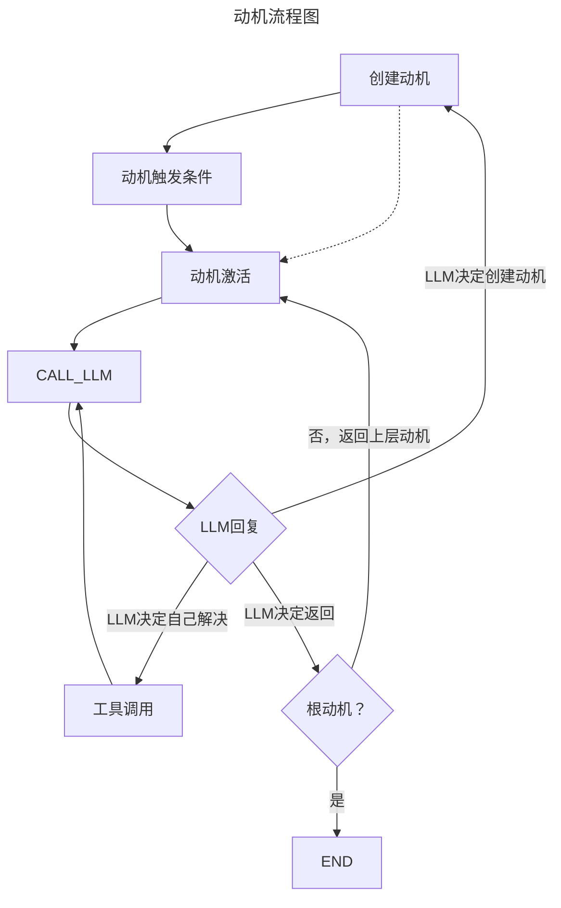

```mermaid
---
title: 动机流程图
---
flowchart TD
    创建动机 --> 动机触发条件
    创建动机 -.-> 动机激活
    动机触发条件 --> 动机激活
    动机激活 --> CALL_LLM
    CALL_LLM -->R
    R@{ shape: diamond, label: "LLM回复" }
    R -- LLM决定自己解决 --> 工具调用
    工具调用 --> CALL_LLM
    R -- LLM决定创建动机 --> 创建动机
    R -- LLM决定返回 --> E
    E@{ shape: diamond, label: "根动机？" }
    E -- 否，返回上层动机 -->  动机激活
    E -- 是 --> END
```